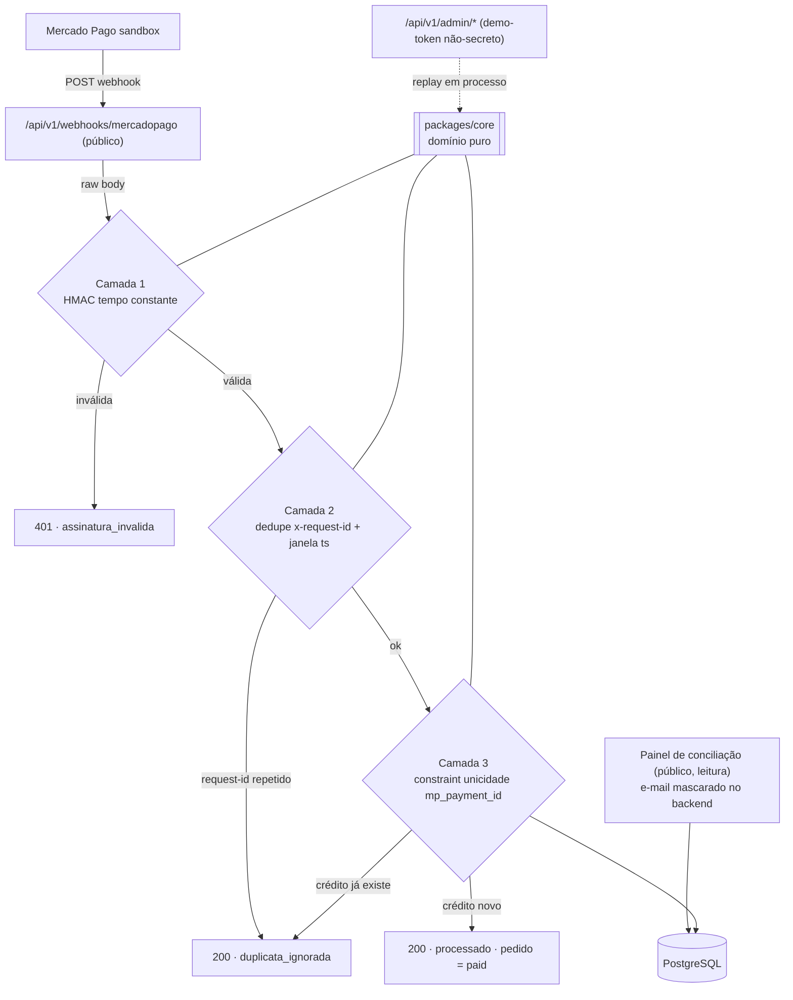

# Arquitetura — Pix Live

> Visão de componentes e fluxos do monorepo. As decisões com trade-off têm ADR
> próprio em [`adr/`](./adr/); o design completo (spec revisada adversarialmente)
> está em [`SPEC.md`](./SPEC.md). Estado do que existe vs. o que é _planejado_:
> seção "Estado atual do build" do [`README.md`](./README.md).

## Visão geral

Monorepo pnpm com o **domínio puro isolado do framework**:

```
pix-live/
├── packages/core     # domínio puro (sem NestJS/Prisma/HTTP) — decide "duplica ou não"
├── apps/api          # NestJS + Prisma + Postgres — transporte, persistência, borda
└── apps/web          # (planejado) React + Vite — loja, página de pagamento, painel
```

- **`packages/core`** — builder do manifesto de assinatura, verificador HMAC em
  tempo constante, decisor de idempotência (ordem dos vereditos), máquina de estados
  do pedido cobrindo todas as transições do MP, formatação de dinheiro em centavos.
  Sem nenhuma dependência de runtime: recebe fatos já apurados e decide.
- **`apps/api`** — módulos NestJS: `webhook` (rota pública, 3 camadas), `admin`
  (simulate/replay com demo-token), `orders` (loja), `reconciliation` (painel, PII
  mascarada no backend), `payment` (porta `PaymentProvider` + adapter mock),
  `prisma` (persistência), `health` (live/ready), `common` (problem+json,
  mascaramento) e `config` (env Zod fail-fast).

## Fluxo do webhook (as três camadas)



Propriedades do pipeline (cada uma com teste de integração contra Postgres real):

1. **Camada 1 — autenticidade** (ADR-0002): assinatura inválida → 401, zero I/O de
   banco, corpo não persistido. Único caminho que devolve 401.
2. **Camada 2 — anti-replay** (ADR-0002): dedupe por unique composto
   `(source, request_id_header)`; `ts` fora da janela de 24h é sinal
   (`ts_suspeito`), não rejeição.
3. **Camada 3 — idempotência de crédito** (ADR-0001): unique em `mp_payment_id`
   dentro de transação; corrida resolvida pelo banco.

Invariantes de segurança do fluxo: status e valor **nunca** vêm do corpo do webhook
(status vem de consulta autenticada ao provider; valor vem do pedido); falha
transitória na consulta → 500 **sem persistir** evento (não envenena o dedupe — a
reentrega do provedor completa o crédito); a rota pública estruturalmente não lê
nenhum campo de origem do request (ADR-0003).

## Separação rota pública × admin

O painel de conciliação é público por design (só leitura). As ações de escrita vivem
em `/api/v1/admin/*` com demo-token não-secreto e rate limit próprio; o replay chama
o core **em processo** (`source='admin_replay'`), nunca a rota pública — detalhe e
justificativa no ADR-0003 e no `SECURITY.md` §5.

## Modelo de dados (Prisma/Postgres)

| Entidade                 | Papel                                                                                                     |
| ------------------------ | --------------------------------------------------------------------------------------------------------- |
| `Product`                | o produto fixo da loja (Kit Caderno Artesanal)                                                            |
| `Order`                  | pedido + cobrança Pix (QR/EMV/expiração), status pela máquina de estados do core                          |
| `OrderCredit`            | o crédito exatamente-uma-vez — **unique em `mp_payment_id`** (Camada 3)                                   |
| `WebhookEvent`           | trilha de auditoria: veredito, assinatura, latência — **unique `(source, request_id_header)`** (Camada 2) |
| `OutboundIdempotencyKey` | idempotência de **saída**: retry de criação de cobrança não duplica chamada ao provider                   |

## Borda e observabilidade

Bootstrap da API: helmet, prefixo global `/api/v1` (health fora), body parser JSON
com cap de 32kb, `trust proxy = 1` (anti-spoof de X-Forwarded-For no rate limit),
throttler estratificado por rota, filtro global problem+json (RFC 9457) sem vazar
interno, logs pino com redaction (authorization/cookie/x-signature/e-mail), env Zod
fail-fast no boot, graceful shutdown drenando requests e fechando o Prisma.
`/health/live` e `/health/ready` (readiness pinga o Postgres).
